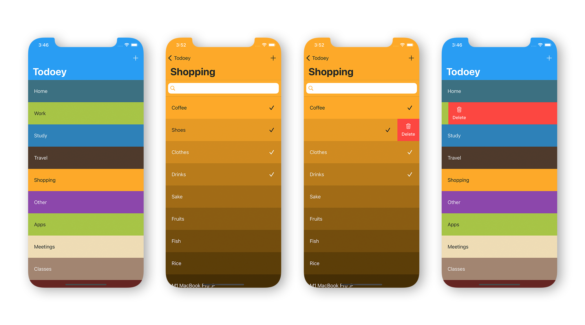
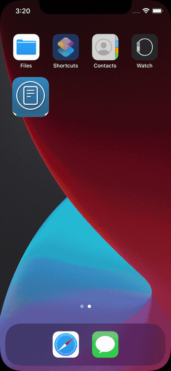
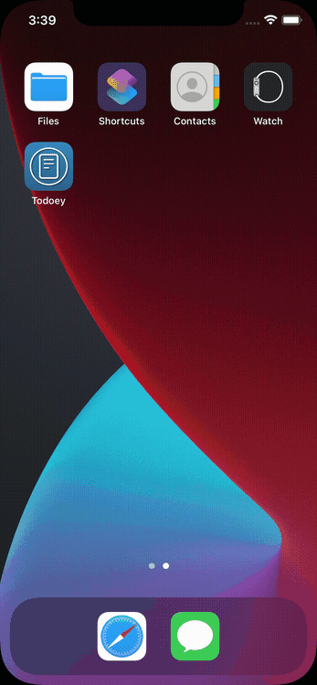
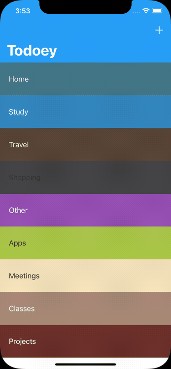
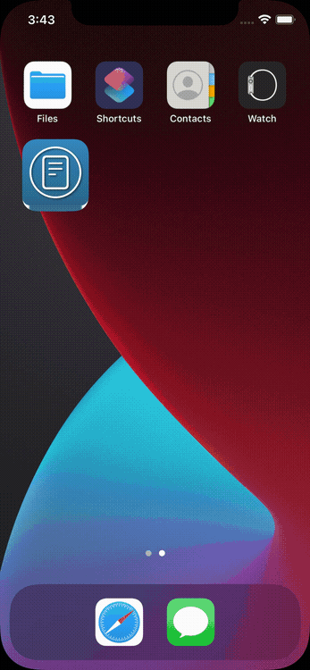
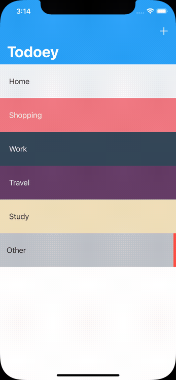
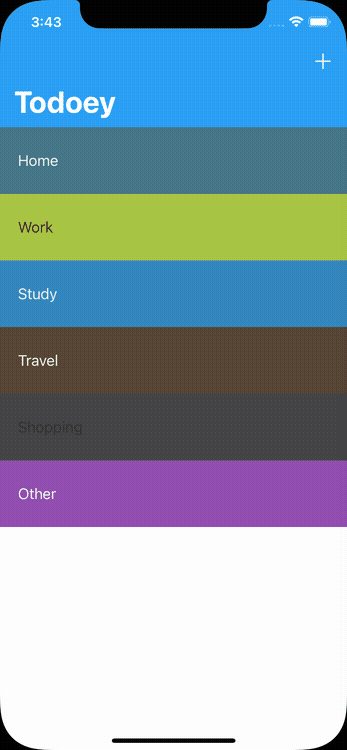

# Todoey

Todo list app created to understand how to save data in iOS. Implementing various choices and learn to use UserDefaults, Core Data and Realm.
Fist UserDefaults is implemented and see it's limitations. Then Switched to Core Data and 
Finally Using Realm Database as an alternative to CoreData because of it's simple yet powerful nature. 


## Learned while creating this app

* How to use UserDefaults
* How to use NSCoder
* How to use CoreData
* SQLite Databases
* Coredata CRUD operations
* Creating entity relationships in CoreData
* How to Query CoreData
* NSPredicates
* Using Realm Database as an alternative to CoreData

## Project setup

1. Clone the project
2. Install [cocoapods](https://guides.cocoapods.org/using/getting-started.html)
3. Run ``` pod install ``` in the same directory as the ```Podfile```
4. Run the ```Todoey.xcworkspace```


## Screens


<br><br>

Add Categories | Add Items
------------ | -------------
&nbsp;&nbsp;&nbsp;&nbsp;&nbsp; &nbsp;&nbsp;&nbsp;&nbsp;&nbsp;| &nbsp;&nbsp;&nbsp;&nbsp;&nbsp;  &nbsp;&nbsp;&nbsp;&nbsp;&nbsp;

<br>

Search Items | Mark Finished Items
------------ | -------------
&nbsp;&nbsp;&nbsp;&nbsp;&nbsp; &nbsp;&nbsp;&nbsp;&nbsp;&nbsp;| &nbsp;&nbsp;&nbsp;&nbsp;&nbsp;  &nbsp;&nbsp;&nbsp;&nbsp;&nbsp;

<br>

Delete Categories | Delete Finished Items
------------ | -------------
&nbsp;&nbsp;&nbsp;&nbsp;&nbsp; &nbsp;&nbsp;&nbsp;&nbsp;&nbsp;| &nbsp;&nbsp;&nbsp;&nbsp;&nbsp;  &nbsp;&nbsp;&nbsp;&nbsp;&nbsp;

<br><br>

>This is a companion project to The App Brewery's Complete App Developement Bootcamp.
